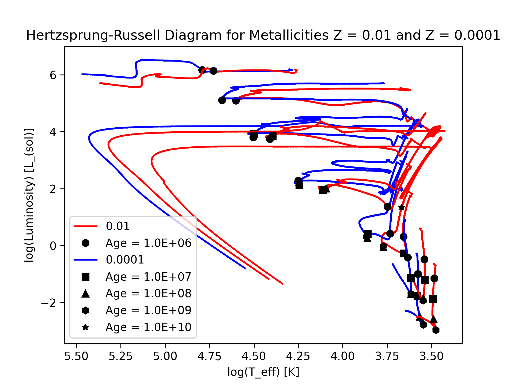
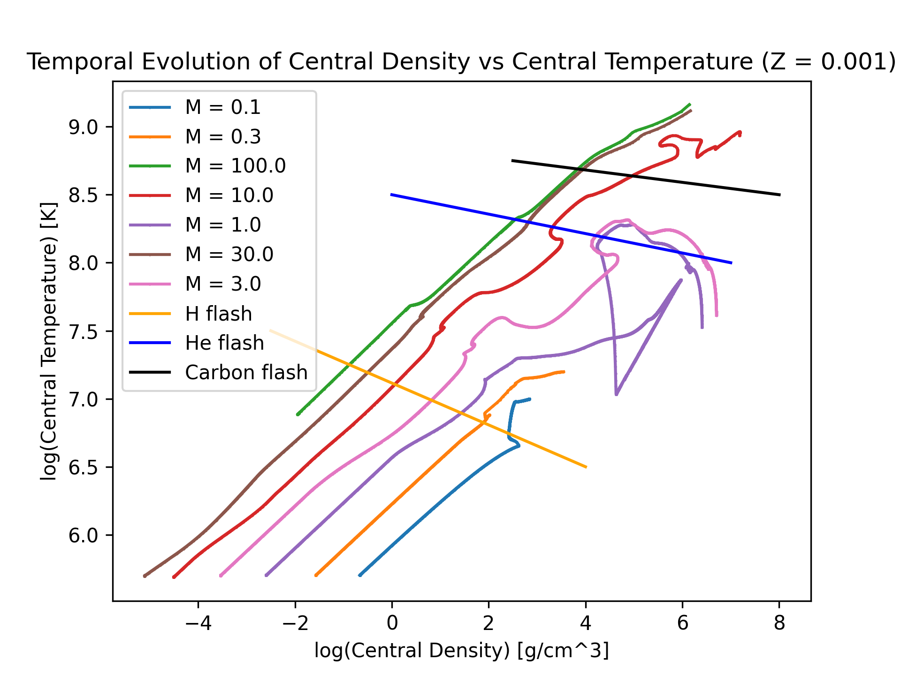
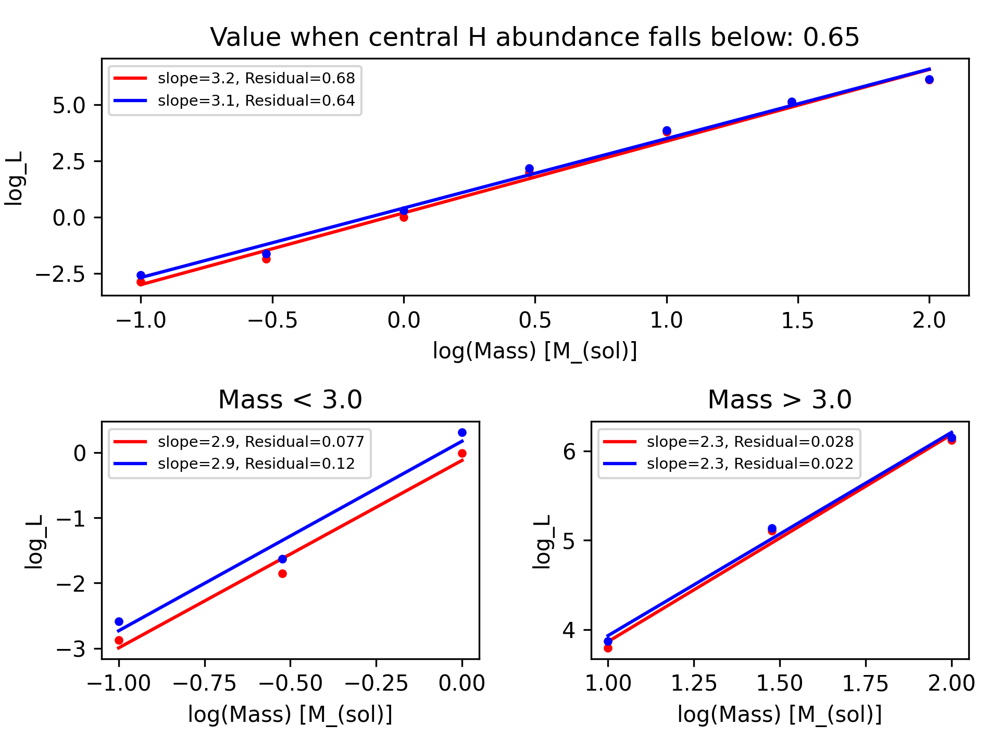
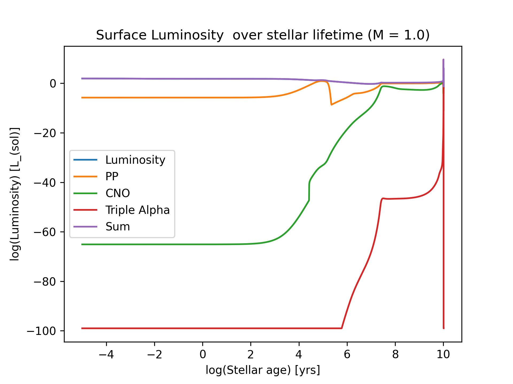

# Stars and Galaxies playground 

## Trajectories on HR diagram 

## Central Density/temperature evolution 

## Temperature fits across the mass spectrum 

## Evolution of surface luminosity (for various masses)

